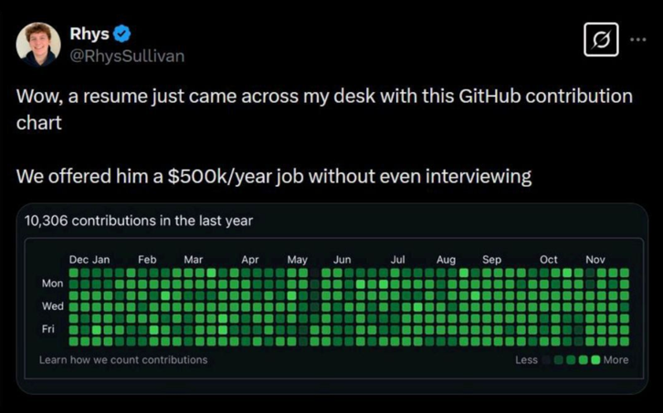
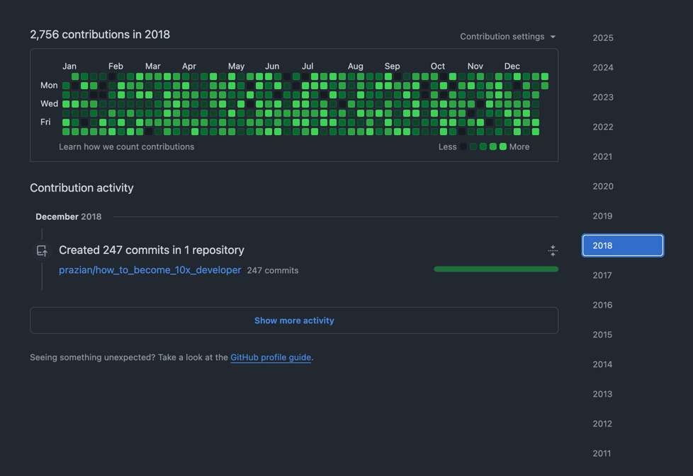

# About
**Spoiler alert:** This project is just a simple "demo" to challenge an idea:   

Want to become a 10x developer like this? 🤑🤑🤑  

## Code Ninja 10x Developers:
- Don't document their code. (job security at max!)
- Don't test, except in production.
- Don't share their knowledge.
- Have no life! They code even in weekends and holidays.
- Don't care about how clean their git history is.
- Add "lines of code" or long stories in MD files to improve metrics.
- Always say "yes boss!" to Scrum Masters and Managers.
- Have superpowers: Memorize all the syntaxes and type fast!
- Just commit, commit, commit, and pushhhhhh.
- But they earn $500K/year! - smart, right?

More commits = more money because we count productivity by the number of commits and lines of code! 😀

How to become a 10x developer?  
That's a secret! And 10x developers never share their secrets! ;)

## A side 10x note

Someone said **"but 10x0 = 0!"**  
Remember, 0x10 = 16 = 2xPizzaTeamDeveloper! 🍕🍕  
If you feel like a 0x developer, no worries! All you need to do is to change the order!

## Am I a code Ninja 10x Developer now?

## Some articles to read:
- [CI/CD2 & Continues Debment: How to deal with technical debt](https://medium.com/@pooyan_razian/ci-cd2-continues-debment-how-to-deal-with-technical-debt-b81129e95466)
- [To be “Microservice” or not to be? — (2B || !2B) 💡](https://medium.com/@pooyan_razian/to-be-microservice-or-not-to-be-2b-2b-35ea55a27f7d)
- [Is microservice architecture for me?](https://medium.com/@pooyan_razian/is-microservice-architecture-for-me-d659e62b855f)
- [Whoever has come up with the term “Scrum master” should have seen developers as “Scrum slaves”! 🛑 ✋](https://medium.com/@pooyan_razian/whoever-coined-the-term-scrum-master-should-have-seen-developers-as-scrum-slaves-4f30c05ec53a)
- [Scrum Master vs Scrum Slaves! 🛑](https://medium.com/@pooyan_razian/scrum-master-vs-scrum-slaves-d60900b876c7)
- [IT job market is dead! Here is why](https://medium.com/@pooyan_razian/it-job-market-is-dead-here-is-why-ddea26536582)
- [What is “right” and what is “wrong”? — in IT](https://medium.com/@pooyan_razian/what-is-right-and-what-is-wrong-in-it-92497e6fa6ec)
- [“Burj Khalifa” feature on someone’s summerhouse?](https://medium.com/@pooyan_razian/lets-build-the-burj-khalifa-feature-on-a-summerhouse-6c8efbd90204)
- [Nothing more permanent than a temporary solution!](https://medium.com/@pooyan_razian/nothing-more-permanent-than-a-temporary-solution-a7b9129f442b)
- [Should I plan or straightly jump into coding?](https://medium.com/@pooyan_razian/should-i-plan-or-straightly-jump-into-coding-6c3135396e4e)
- [Consistency: The key to growth!](https://medium.com/@pooyan_razian/consistency-the-key-to-growth-ea1e6af31704)

You can read more articles [here](https://www.pooyan.info/articles).

## Who am I?
- [Personal Website](https://pooyan.info)
- [LinkedIn](https://www.linkedin.com/in/prazian/)
- [Medium](https://medium.com/@pooyan_razian)

## The secret truth!
This section is for those who really want to know the truth 👇

[//]: # (Don't be such a 10x developer!)
[//]: # (Scrum Master or Scrum slave, that is the question!)
[//]: # (Scrum usually is a mask to hide micromanagement.)
[//]: # (Trust your experts.)
[//]: # (Developers are not your kids.)
[//]: # (We don't need no thought control!)
[//]: # (Most Scrum meetings are a waste of time.)
[//]: # (Scrum is a scam? ¯\_\(ツ\)_/¯ )
[//]: # (A bad Scrum kills productivity.)
[//]: # (A bad Scrum kills trust.)
[//]: # (A bad Scrum kills team spirit.)
[//]: # (A bad Scrum can be the result of "lack of trust".)
[//]: # (Don't count 10xness by the number of commits)
[//]: # (Don't count 10xness by the lines of code)
[//]: # (Impact is what values the most)
[//]: # (Quality cannot be easily measured)
[//]: # (Quantity can be faked! Don't be scamed.)

👆