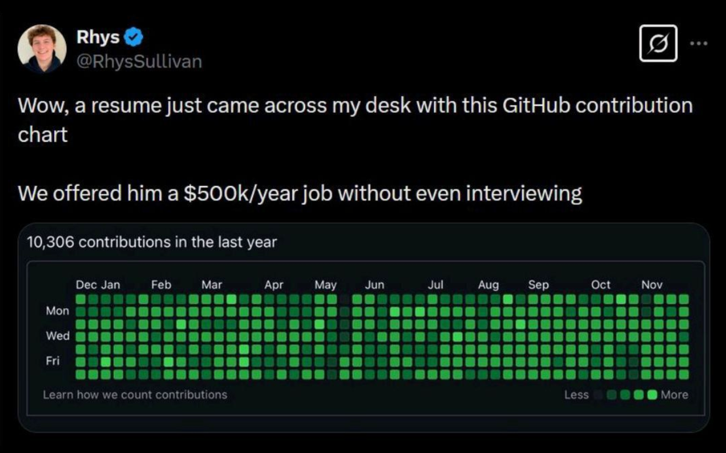
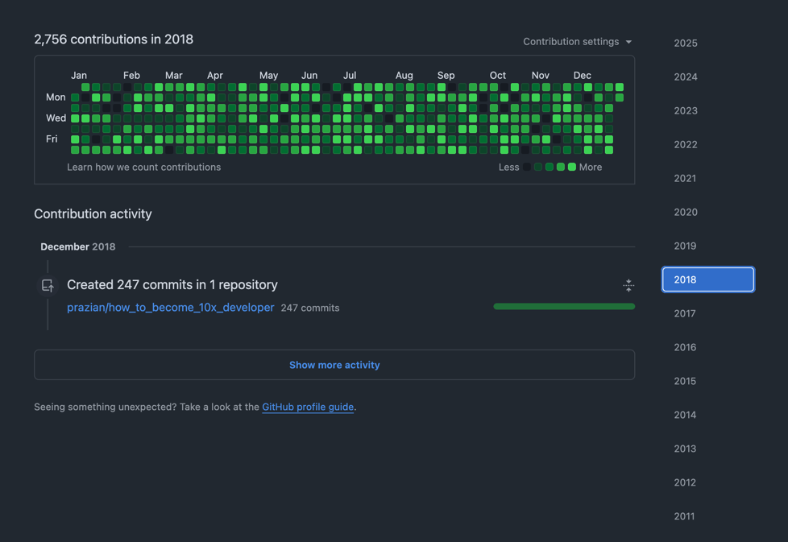

# About
**Spoiler alert:** This project is just a simple "demo" to challenge an idea:   

Want to become a 10x developer like this? 🤑🤑🤑  

## Code Ninja 10x Developers:
- Don't document their code. (job security at max!)
- Don't test, except in production.
- Don't share their knowledge.
- Have no life! They code even in weekends and holidays.
- Don't care about how clean their git history is.
- Add "lines of code" or long stories in MD files to improve metrics.
- Always say "yes boss!" to Scrum Masters and Managers.
- Have superpowers: Memorize all the syntaxes and type fast!
- Just commit, commit, commit, and pushhhhhh.
- But they earn $500K/year! - smart, right?

More commits = more money because we count productivity by the number of commits and lines of code! 😀

How to become a 10x developer?  
That's a secret! And 10x developers never share their secrets! ;)

## A side 10x note

Someone said **"but 10x0 = 0!"**  
Remember, 0x10 = 16 = 2xPizzaTeamDeveloper! 🍕🍕  
If you feel like a 10x0=0 developer, no worries! All you need to do is to change the order!

## Am I a code Ninja 10x Developer now?

## Some articles to read:
- [Make dependency updates boring again](https://dev.to/prazian/make-dependency-updates-boring-again-3cfm)
- [The license risk hiding in your dependency tree](https://dev.to/prazian/the-license-risk-hiding-in-your-dependency-tree-2d1)
- [Quiet browsing? Tabby keeps you company](https://dev.to/prazian/quiet-browsing-tabby-keeps-you-company-j77)
- [To test or not to test, "How" is the question!](https://dev.to/prazian/to-test-or-not-to-test-how-is-the-question-1l2e)
- [Cloud vendor lock-in! How much should I be scared of?](https://dev.to/prazian/cloud-vendor-lock-in-how-much-should-i-be-scared-of-19h0)
- [Have ADHD? Try Why Am I Here](https://dev.to/prazian/have-adhd-try-why-am-i-here-94j)
- [Forget what you read? Breadcrumb helps](https://dev.to/prazian/forget-what-you-read-breadcrumb-helps-48m1)
- [Clean up years of GitHub Actions runs automatically](https://dev.to/prazian/clean-up-years-of-github-actions-runs-automatically-33pe)
- [From "spaghetti code" to "spaghetti architecture"](https://dev.to/prazian/from-spaghetti-code-to-spaghetti-architecture-3b7o)
- [Effective Metrics and Alerts](https://dev.to/prazian/effective-metrics-and-alerts-2070)
- [CI/CD pipeline Best practices](https://dev.to/prazian/cicd-pipeline-best-practices-7ac)
- [CAP theorem: Pick two](https://dev.to/prazian/cap-theorem-pick-two-202a)

You can find the full list on [dev.to/prazian](https://dev.to/prazian).

More technical deep-dives:
- [The license risk hiding in your dependency tree](https://pooyan.info/articles/open-license-auditor-github-action)
- [Make dependency updates boring again](https://pooyan.info/articles/update-dependencies-github-action)
- [Clean up years of GitHub Actions runs automatically](https://pooyan.info/articles/prune-old-github-actions-runs)

More on Scrum and management:
- [Scrum is a nice term to hide bad management](https://www.pooyan.info/articles/scrum-is-a-nice-term-to-hide-bad-management)
- [You don't need that many meetings](https://www.pooyan.info/articles/change-my-mind-meetings)
- [The Reality of Story Points](https://www.pooyan.info/articles/change-my-mind-story-point)
- [CI/CD2 & Continuous Debment: How to deal with technical debt](https://www.pooyan.info/articles/ci-cd2-how-to-deal-with-technical-debt)
- [Should I plan or straightly jump into coding?](https://www.pooyan.info/articles/should-i-plan-or-straightly-jump-into-coding)
- [Let's build the Burj Khalifa feature on a summerhouse](https://www.pooyan.info/articles/lets-build-the-burj-khalifa-feature-on-a-summerhouse)

More articles [here](https://www.pooyan.info/articles).

## Who am I?
- [Personal Website](https://pooyan.info)
- [LinkedIn](https://www.linkedin.com/in/prazian/)
- [dev.to](https://dev.to/prazian)

## The secret truth!
This section is for those who really want to know the truth 👇

[//]: # (Don't be such a 10x developer!)
[//]: # (Scrum Master or Scrum slave, that is the question!)
[//]: # (Scrum usually is a mask to hide micromanagement.)
[//]: # (Trust your experts.)
[//]: # (Developers are not your kids.)
[//]: # (We don't need no thought control!)
[//]: # (Most Scrum meetings are a waste of time.)
[//]: # (Scrum is a scam? ¯\_\(ツ\)_/¯ )
[//]: # (A bad Scrum kills productivity.)
[//]: # (A bad Scrum kills trust.)
[//]: # (A bad Scrum kills team spirit.)
[//]: # (A bad Scrum can be the result of "lack of trust".)
[//]: # (Don't count 10xness by the number of commits.)
[//]: # (Don't count 10xness by the lines of code.)
[//]: # (Impact is what values the most.)
[//]: # (Quality cannot be easily measured.)
[//]: # (Quantity can be faked! Don't be scamed.)

👆